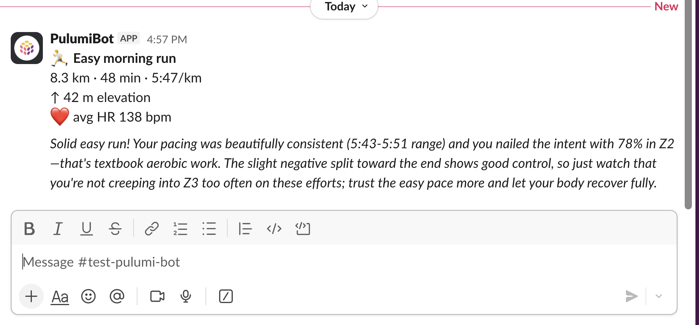

# strava-slack-bot



This app receives running data from your watch via a [Strava-to-SQS bridge](#setting-up-a-strava-to-sqs-bridge), feeds it to an LLM acting as a running coach, and posts the feedback to a Slack channel of your choice. Infrastructure is deployed to AWS Lambda using Pulumi, and New Relic instruments it for observability.

```
Strava → [webhook bridge] → SQS → Lambda (container) → Slack
```

## Prerequisites

- [Pulumi CLI](https://www.pulumi.com/docs/install/)
- [uv](https://docs.astral.sh/uv/getting-started/installation/)
- AWS credentials configured
- Docker
- A Slack bot token — see [Setting up the Slack bot](#setting-up-the-slack-bot)

## Quickstart

```bash
cp .env.sample .env
# fill in SLACK_BOT_TOKEN and SLACK_CHANNEL in .env

make config    # pushes .env values into Pulumi config
make deploy    # builds container, pushes to ECR, provisions everything
make send      # sends a test run event (TYPE=easy|long|tempo, default easy)
make logs      # tail Lambda logs
```

## Setting up the Slack bot

1. Go to [api.slack.com/apps](https://api.slack.com/apps) → **Create New App** → From scratch
2. Under **OAuth & Permissions**, add these bot token scopes:
   - `chat:write`, `chat:write.public`
3. Click **Install to Workspace** — copy the **Bot User OAuth Token** (`xoxb-...`)
4. Invite the bot to your channel: `/invite @your-bot-name`

Put the token in `.env` as `SLACK_BOT_TOKEN`.

## What gets deployed

- **ECR** — container image repository
- **SQS queue** — receives run events (with a dead-letter queue)
- **Lambda** — processes events and posts to Slack
- **IAM** — role with least-privilege SQS access

## SQS message shape

```json
{
  "activity": {
    "name": "Easy morning run",
    "activity_type": "Run",
    "distance_km": 8.3,
    "moving_time_min": 48,
    "pace_str": "5:47",
    "elevation_gain_m": 62,
    "avg_hr": 141.0
  }
}
```

## Demo: failure scenario

This is the live-stream demo flow for showing New Relic error alerting and DLQ recovery.

**1. Flood the queue with bad payloads**

```bash
make flood-bad
```

Sends 5 malformed messages (missing the `activity` wrapper). The Lambda crashes on each with a `KeyError`. Because `maxReceiveCount=3`, each message retries 3 times before landing in the dead-letter queue — 15 Lambda errors total.

**2. Observe in New Relic**

The error spike shows up in the Lambda errors dashboard. Each failure logs the exception and stack trace.

**3. Fix the handler**

In `app/handler.py`, the handler assumes `body["activity"]` always exists. Add a guard:

```python
if "activity" not in body:
    print(f"Skipping malformed message: {body}")
    continue
```

**4. Redeploy and redrive**

```bash
make deploy    # rebuild container with the fix
make redrive   # move DLQ messages back to the main queue
make logs      # watch the reprocessed messages succeed
```

## Using Pulumi ESC instead of .env

If you prefer to manage secrets in [Pulumi ESC](https://www.pulumi.com/docs/esc/), skip `make config` and set up an ESC environment instead:

```bash
esc env init <your-org>/strava-slack-bot/dev
esc env set --secret <your-org>/strava-slack-bot/dev pulumiConfig.strava-slack-bot:slackBotToken xoxb-...
esc env set <your-org>/strava-slack-bot/dev pulumiConfig.strava-slack-bot:slackChannel your-channel
```

Then reference it in `infra/Pulumi.dev.yaml`:

```yaml
environment:
  - strava-slack-bot/dev
config:
  aws:region: us-east-1
```

## Setting up a Strava-to-SQS bridge

This demo uses synthetic run events (`make send`), but to wire in real Strava data:

1. Create a [Strava API application](https://developers.strava.com/docs/getting-started/) and subscribe to the webhook.
2. Deploy a small HTTP endpoint (API Gateway + Lambda or a simple server) that receives the Strava webhook POST and forwards it to SQS.
3. Point the webhook subscription at that endpoint.

The SQS message format is documented in [SQS message shape](#sqs-message-shape).

## Going further

Things to try once the basic demo is working:

- **Move to Fargate** — swap the Lambda for an ECS Fargate task to handle longer-running workloads and persistent connections.
- **Try Google Cloud Run** — port the Pulumi program to GCP using `pulumi-gcp`; the container and app code stay the same.
- **Wire a real Strava bridge** — set up the webhook integration above so your actual runs trigger the bot automatically.
- **Add a New Relic custom dashboard** — instrument the Lambda to emit a custom event or metric (e.g. run distance, coaching latency) and build a NR dashboard that tracks your training over time.

---

*This repo is used live in the [Pulumi × New Relic live stream](https://www.pulumi.com). Adam posts to `#test-pulumi-bot` in the [Pulumi Community Slack](https://slack.pulumi.com).*
