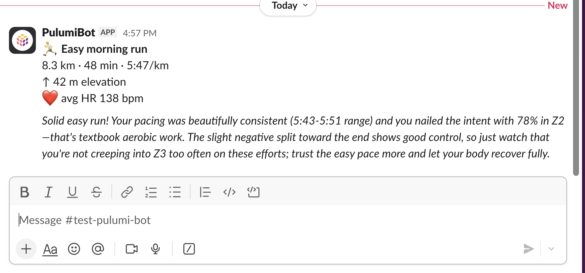

# strava-slack-bot



Get AI coaching feedback on every run, posted to Slack automatically. Each run syncs from Strava via a webhook bridge into SQS, a Lambda function calls Claude on Amazon Bedrock to generate a short coaching note, and the result lands in a channel of your choice. Pulumi manages the infrastructure; New Relic instruments it for observability.

```
Strava → [webhook bridge] → SQS → Lambda (container) → Slack
```

> **Note:** This is the live-stream version — designed to be deployed and broken on camera.
> For a more complete implementation from the "I Built an AI Running Coach" talk, see
> [adamgordonbell/ai-running-coach](https://github.com/adamgordonbell/ai-running-coach).

## Prerequisites

- [Pulumi CLI](https://www.pulumi.com/docs/install/)
- [uv](https://docs.astral.sh/uv/getting-started/installation/)
- AWS credentials configured, with Bedrock access to Claude Haiku 4.5 enabled in the account
- Docker
- A Slack bot token — see [Setting up the Slack bot](#setting-up-the-slack-bot)

## Quickstart

```bash
cp .env.sample .env
# fill in SLACK_BOT_TOKEN and SLACK_CHANNEL in .env
# optional: NEW_RELIC_LICENSE_KEY + NEW_RELIC_ACCOUNT_ID to turn on New Relic

make config    # pushes .env values into Pulumi config
make deploy    # builds container, pushes to ECR, provisions everything
make send      # sends a test run event (TYPE=easy|long|tempo, default easy)
make logs      # tail Lambda logs
make status    # queue + DLQ depth, invocations, errors (AWS only, no New Relic)
make watch     # same, refreshing every 5 s
make nr-check  # what New Relic has seen in the last hour (needs NEW_RELIC_USER_API_KEY + NEW_RELIC_ACCOUNT_ID)
```

## Setting up the Slack bot

1. Go to [api.slack.com/apps](https://api.slack.com/apps) → **Create New App** → From scratch
2. Under **OAuth & Permissions**, add these bot token scopes:
   - `chat:write`, `chat:write.public`
3. Click **Install to Workspace** — copy the **Bot User OAuth Token** (`xoxb-...`)
4. Invite the bot to your channel: `/invite @your-bot-name`

Put the token in `.env` as `SLACK_BOT_TOKEN`.

## What gets deployed

- **ECR** — container image repository
- **SQS queue** — receives run events (with a dead-letter queue)
- **Lambda** — processes events and posts to Slack
- **IAM** — role with least-privilege SQS access

Every taggable resource carries an `Owner` tag from `aws:defaultTags` in `infra/Pulumi.dev.yaml`.
Shared demo accounts often run a cleanup job that deletes untagged resources; set the tag to your
own email before deploying into one:

```bash
cd infra && pulumi config set --path 'aws:defaultTags.tags.Owner' you@example.com
```

## SQS message shape

```json
{
  "activity": {
    "name": "Easy morning run",
    "activity_type": "Run",
    "run_type": "easy",
    "distance_km": 8.3,
    "moving_time_min": 48,
    "pace_str": "5:47",
    "elevation_gain_m": 42,
    "avg_hr": 138.0,
    "hr_zones": {"1": 5, "2": 78, "3": 15, "4": 2, "5": 0},
    "splits": ["5:51", "5:49", "5:45", "5:44", "5:48", "5:50", "5:47", "5:43"]
  }
}
```

## Using Pulumi ESC instead of .env

If you prefer to manage secrets in [Pulumi ESC](https://www.pulumi.com/docs/esc/), skip `make config` and set up an ESC environment instead:

```bash
esc env init <your-org>/strava-slack-bot/dev
esc env set --secret <your-org>/strava-slack-bot/dev pulumiConfig.strava-slack-bot:slackBotToken xoxb-...
esc env set <your-org>/strava-slack-bot/dev pulumiConfig.strava-slack-bot:slackChannel your-channel
# optional — turns on the New Relic wrapper, AI monitoring, and log forwarding
esc env set --secret <your-org>/strava-slack-bot/dev pulumiConfig.strava-slack-bot:newRelicLicenseKey <ingest-licence-key>
esc env set <your-org>/strava-slack-bot/dev pulumiConfig.strava-slack-bot:newRelicAccountId <account-id>
```

Then reference it in `infra/Pulumi.dev.yaml`:

```yaml
environment:
  - strava-slack-bot/dev
config:
  aws:region: ca-central-1
```

## New Relic

The container image bakes in New Relic's Lambda layer (Python agent, handler wrapper, and the
Lambda extension) from `public.ecr.aws/newrelic-lambda-layers-for-docker`. Nothing runs until
`newRelicLicenseKey` is set in Pulumi config; then the function boots through
`newrelic_lambda_wrapper.handler`, AI monitoring captures the Bedrock `converse` call as an LLM
trace, and the extension forwards function logs.

One quirk of APM mode: the extension only ships an invocation's telemetry when the *next*
invocation starts (or when the container shuts down), so a single `make send` is invisible in
New Relic until something else runs. `make flush` sends an empty direct invoke that the handler
ignores, which pushes the previous run's data out within a few seconds. Bursts like
`make flood-bad` don't need it. Optional config: `bedrockModelId` (default
`us.anthropic.claude-haiku-4-5-20251001-v1:0`). `pulumi config set newRelicDebug true` adds extension and
agent debug logs to CloudWatch. `make nr-check` queries NerdGraph for invocation, error, LLM and log
counts so you can confirm data arrived without opening the UI; it wants a **User** key (`NRAK-…`) in
`NEW_RELIC_USER_API_KEY`, which is separate from the ingest licence key the Lambda uses.

Set that same User key as `newRelicApiKey` (`pulumi config set --secret newRelicApiKey NRAK-…`) and
`pulumi up` also links the AWS account to New Relic: an IAM role New Relic assumes, plus the Lambda
polling integration. Without the link the telemetry still lands in NRQL and Logs, but New Relic never
creates a Lambda entity, so APM & Services, Serverless functions, Errors Inbox and AI Monitoring stay
empty. The entity appears within a polling cycle (about five minutes) of the first invocation.
The function also runs in New Relic's APM mode (`NEW_RELIC_APM_LAMBDA_MODE`), so it shows up as the
`strava-slack-bot` service under APM & Services, and AI Monitoring picks up the Bedrock calls.

## Letting someone else trigger runs

A small second Lambda with a function URL drops runs onto the queue over HTTP, so a guest
without AWS access can generate data. It is gated by a shared key:

```bash
cd infra && pulumi config set --secret triggerKey $(openssl rand -hex 16) && pulumi up
make trigger TYPE=bad      # same as make send, over HTTP (easy | long | tempo | bad | flush)
make trigger-url           # prints the curl line to share privately
```

## Setting up a Strava-to-SQS bridge

This demo uses synthetic run events (`make send`), but to wire in real Strava data:

1. Create a [Strava API application](https://developers.strava.com/docs/getting-started/) and subscribe to the webhook.
2. Deploy a small HTTP endpoint (API Gateway + Lambda or a simple server) that receives the Strava webhook POST and forwards it to SQS.
3. Point the webhook subscription at that endpoint.

The SQS message format is documented in [SQS message shape](#sqs-message-shape).

## Going further

- **Move to Fargate** — swap the Lambda for an ECS Fargate task to handle longer-running workloads and persistent connections.
- **Try Google Cloud Run** — port the Pulumi program to GCP using `pulumi-gcp`; the container and app code stay the same.
- **Wire a real Strava bridge** — set up the webhook integration above so your actual runs trigger the bot automatically.
- **Add a New Relic custom dashboard** — instrument the Lambda to emit a custom metric (run distance, coaching latency) and track your training over time.

For the live-stream failure scenario and step-by-step walkthrough, see [TUTORIAL.md](TUTORIAL.md).

---

*This repo is used live in the [Pulumi × New Relic live stream](https://www.pulumi.com). Adam posts to `#test-pulumi-bot` in the [Pulumi Community Slack](https://slack.pulumi.com).*
