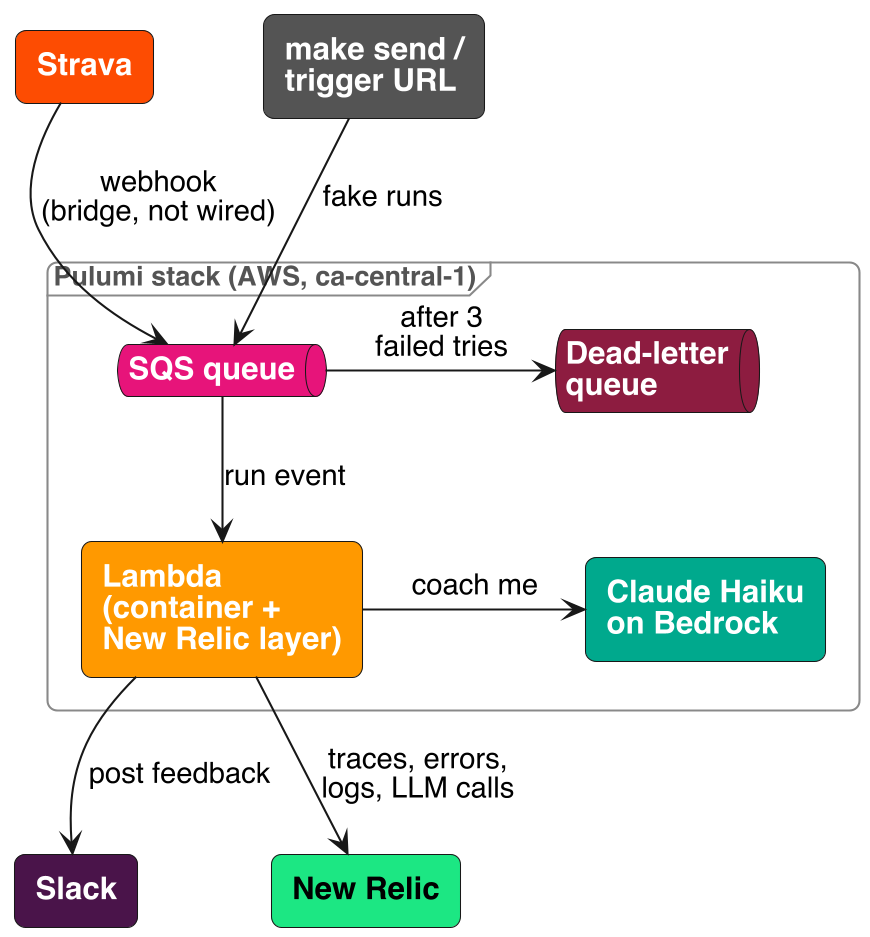
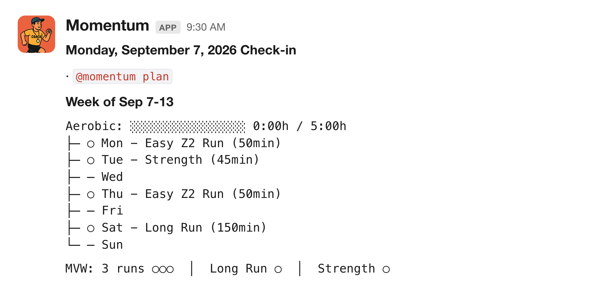
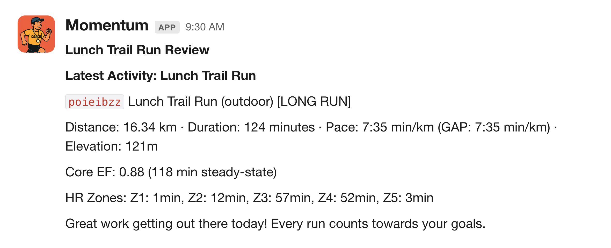
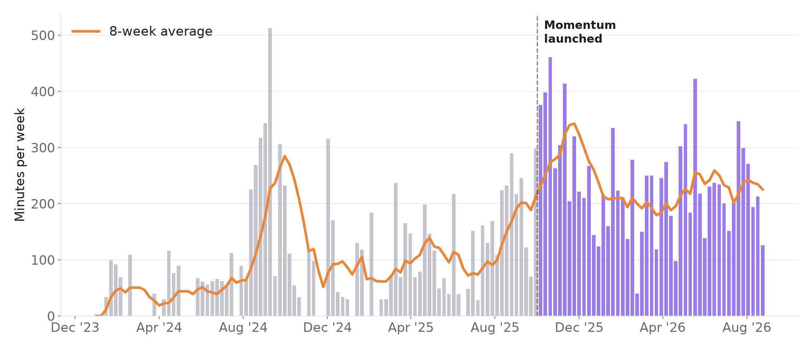

# Visuals and links

## This app

Runs land on an SQS queue, a container Lambda asks Claude on Bedrock for two sentences of coaching,
and PulumiBot posts it to Slack. A message that fails three times moves to the dead-letter queue.
The New Relic layer in the container ships traces, errors, logs and the LLM call. Everything inside
the frame is one Pulumi program (`infra/__main__.py`). Strava isn't wired up in this version;
`make send` and the trigger URL stand in for its webhook. Source: `architecture.puml`.

## The real one: Momentum

This repo is the stream-sized version of Momentum, the running coach I've used since October 2025.
It pulls from Strava and Peloton, keeps training history in DynamoDB, checks in every morning, and
answers back in Slack.

Every Monday it posts the week's plan, and the circles fill in as runs land:

After each run it posts a review, heart rate zones included:

Did it work? Weekly training minutes, before and after Momentum launched:

## Links

- My Strava: https://www.strava.com/athletes/17907995
- The Slack channel PulumiBot posts to: `#test-pulumi-bot` in the Pulumi Community Slack
  (join at https://slack.pulumi.com)
- The fuller coach: https://github.com/adamgordonbell/ai-running-coach
- The talk this came from, "I Built an AI Running Coach" (SCaLE 23x):
  https://www.youtube.com/watch?v=ZGjOQkS540g&t=10085s
